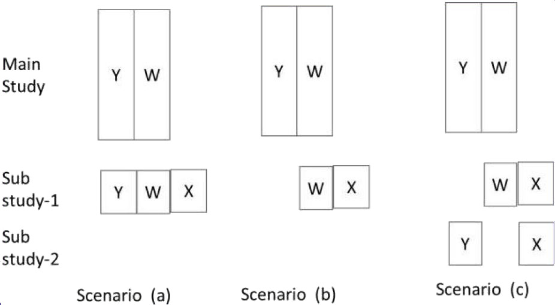

# Data Generation

```{r setup, include=F}
library(dplyr)
library(MASS)
library(mice)
library(VIM)
library(tidyverse)
library(ggpubr)
library(ggsci)

wd <- dirname(rstudioapi::getActiveDocumentContext()$path)

set.seed(420)

avg <- seq(0,2)
vcm <- matrix(data = c(1,1,1.7,1,2, 1.5, 1.7, 1.5, 4), nrow = 3, byrow = T)

data <- mvrnorm(1000, avg, vcm) %>% data.frame()
colnames(data) <- c("X", "Y", "W")

maxit_ <- 20 
m_ <- 5
method_ <- "pmm" 
```

# task a)

The goal is to infer about the regression coefficient for X in the model $Y = \beta_0 + \beta_1X + \varepsilon , \varepsilon \sim N(0, \sigma^2)$. Set aside the first 900 observations as data from the main study and treat the remaining 100 observations as data from a substudy. Fit the above regression model on the main study data and store the point estimates of $\beta_0$, $\beta_1$ and $\sigma$ and the interval estimate of $\beta_1$.

```{r}
#Set aside first 900 obs as data from main study
main <- data %>% slice_head(n = 900)

#Remaining 100 observations as data from a substudy
sub <- data %>% slice_tail(n = 100)
```


```{r}
task_a <- function(main, sub){
  
  #Fit regression model on the main study 
  main.lm <- summary(lm(Y ~ X, data = main), conf.int=T)
  beta_0_main <- main.lm$coef[1,1]
  beta_0_sigma <- main.lm$coef[1,2]
  beta_1_main <- main.lm$coef[2,1]
  beta_1_sigma <- main.lm$coef[2,2]
  sigma_main <- main.lm$sigma
  mse <- mean(main.lm$residuals^2)
  
  int_est_beta_1 <- confint(lm(Y~X, data =main))[2,]
  
  list("beta_0" = beta_0_main,
       "beta_0_simga" = beta_0_sigma,
       "beta_1" = beta_1_main,
       "beta_1_sigma" = beta_1_sigma,
       "beta_1_confint" = as.numeric(int_est_beta_1),
       "sigma" = sigma_main)
}

task_a(main, sub)
```

Extracting the $\sigma$ for the model is non-trivial for `mice` models. We have to do Rubin's rules by hand (this is taken from Übung 4):

```{r}
MI_analysis <- function(Q_hat, U_hat, m) {
  #' Function that applies Rubin's rules to get the residual variance of the imputation
  if (class(Q_hat) == "matrix") {
    # pooled estimator:
    q_bar <- colSums(Q_hat) / m
    # within-variance:
    u_bar <- colSums(U_hat) / m
    # between-variance:
    B <-
      colSums((Q_hat - matrix(1, nrow = m, ncol = 1) %*% q_bar) ^ 2) / (m - 1)
  }
  else{
    q_bar <- sum(Q_hat) / m
    u_bar <- sum(U_hat) / m
    B <- (1 / (m - 1)) * sum((Q_hat - q_bar) ^ 2)
  }
  
  # total variance (sigma^2):
  sigma_sq <- u_bar + B + B / m
  
  # SD (sigma):
  sigma <- sqrt(sigma_sq)
  
  # degrees of freedom:
  df <- (m - 1) * (1 + (m / (m + 1)) * u_bar / B) ^ 2
  # confidence intervals:
  CIlow <- q_bar - qt(0.975, df) * sigma
  CIupper <- q_bar + qt(0.975, df) * sigma
  r <- (B + B / m) / u_bar
  
  list("sigma" = sigma, "squared" = sigma_sq, "CIl" = CIlow,  "CIu" = CIupper)
}

get_pred_var <- function(mids, n = 1000){
  
  mids_complete <- complete(mids, action = "long", include = F)
  
  theta_b <- aggregate(Y ~ .imp, data = mids_complete, "mean")$Y
  var_b <- aggregate(Y ~ .imp, data = mids_complete, "var")$Y/n
  
  MI_analysis(theta_b, var_b, mids$m)
}

# Helper functions

gen_pred_mat <- function(){
  pred_mat <- matrix(rep(0, 9), ncol = 3)
  rownames(pred_mat) <- colnames(pred_mat) <- c("X", "Y", "W")
  
  pred_mat
}

gen_relevant_vals <- function(summary, mids){
  
  list("beta_0" = summary$estimate[1],
       "beta_0_sigma" = summary$std.error[1],
       "beta_1" = summary$estimate[2],
       "beta_1_sigma" = summary$std.error[2],
       "beta_1_confint" = c(summary$`2.5 %`[2], summary$`97.5 %`[2]),
       "sigma" = get_pred_var(mids))
}
```

# task b)

Create a data corresponding to scenario (a) in Figure 8.1 by deleting X from the main study. Multiply impute the missing values of X in the main study. Perform multiply imputed analysis and again store the point and interval estimates of the same parameters.



```{r}
task_b <- function(main, sub, orig.data = data, method = method_, maxit = maxit_, m = m_, pool.syn = F){
  main["X"] <- NA
  
  # Immpute
  b_data <- rbind(main, sub)
  b_imp <- mice(b_data, print = F, maxit = maxit, m = m, method = method)
  
  # Plot diagnostics
  plot(b_imp)
  
  # Regress
  b_reg <- with(b_imp, lm(Y~X))
  if (!pool.syn) b_res <- pool(b_reg)
  else b_res <- pool.syn(b_reg) # Use pool.syn as we have synthetic data!
  b_res_sum <- summary(b_res, conf.int = T)
  
  gen_relevant_vals(b_res_sum, b_imp)
}

task_b(main, sub)
```

Note that the CI gets substantially smaller when using the `pool.syn()` function, that is supposed to be used for synthetic data according to the `mice` documentation: 

```{r}
task_b(main, sub, pool.syn = T)
```


# task c)

Create a data corresponding to scenario (b) by deleting X values from the main study and Y values from the substudy. Multiply impute the missing values of X in the main study. Perform multiply imputed analysis as in (b).

> After discussions with Paul and the other group, we decided to go with a more basic imputation strategy. Our initial attempts can be found at the end of thhe script.

```{r}
task_c <- function(main, sub, orig.data = data, method = method_, maxit = 10, m = 25, pool.syn = F){
  main["X"] <- NA
  sub["Y"] <- NA
  
  c_data <- rbind(main, sub)
  
  c_imp <- mice(c_data, method = method, maxit = maxit, m = m, printFlag = F)
  c_reg <- with(c_imp, lm(Y~X))
  if(!pool.syn) c_res <- pool(c_reg)
  else c_res <- pool.syn(c_reg)
  c_res_sum <- summary(c_res, conf.int = T)
  
  gen_relevant_vals(c_res_sum, c_imp)
}

task_c(main, sub)
```

## High CIs -> Investigate

> Even though we get the true $\beta_\text{true} \in \text{CI}(\hat\beta)$, we can see that the actual estimate is far off and we have a large CI (i.e. high bias).

Note that this changes if we use the `pool.syn()` function - this leads to a substantial decrease in the CI size, but also decreases the coverage enormously. In out different tests, we were not able to achieve coverage > 10% for task C.

```{r}
task_c(main, sub, pool.syn = T)
```


In [Van Buuren (2013)](https://stefvanbuuren.name/fimd/sec-FCS.html) the author says that it is important to be able to estimate the true correlation between the missing variables. Since we have no observations in which both $X$ and $Y$ are observed together, this is basically impossible: 

We have 'true' correlations between variables: 

* $\rho(X,Y) \approx .697$
* $\rho(X,W) \approx .838$
* $\rho(Y,W) \approx .491$

```{r}
knitr::kable(cor(data))
```

We can run simple simulation to show that the estimations don't converge for our methods, even for high number of iterations (which is what is suggested by Van Buuren). 

```{r, fig.width = 8, fig.height=6}
c_data_investigate <- data
c_data_investigate[1:900, "X"] <- NA
c_data_investigate[901:1000, "Y"] <- NA

maxit <- c(1, 5, 10, 25, 50, 100, 250)
methods <- c("pmm", "norm", "midastouch", "cart")

cor_vals <- beta_1_vals <-  matrix(data = NA, nrow = length(maxit), ncol = length(methods))
```


```{r, fig.width = 8, fig.height=6, eval = F}
# Since knitting would take forever, we just load the data as a .rds file
for (iter in 1:length(maxit)){
  print(iter)
  for (method in 1:length(methods)){
    print(methods[method])
    imputed <- mice(c_data_investigate, method = methods[method], m = 25, maxit = maxit[iter], print = F)
    cor_x_y <- unlist(with(imputed, cor(X, Y))$analyses)
    regression <- pool(with(imputed, lm(Y~X)))
    cor_vals[iter, method] <- mean(cor_x_y)
    beta_1_vals[iter, method] <- gen_relevant_vals(summary(regression), imputed)$beta_1
  }
}

saveRDS(cor_vals, file = sprintf("%s/data_files/correlation_estimation.rds", wd))
saveRDS(reg_vals, file = sprintf("%s/data_files/regression_estimation.rds", wd))
```

```{r, fig.width = 7, fig.height = 7}
cor_vals <- readRDS(sprintf("%s/data_files/correlation_estimation.rds", wd))
beta_1_vals <- readRDS(sprintf("%s/data_files/regression_estimation.rds", wd))

cor_vals <- data.frame(cor_vals)
cor_vals$maxit <- maxit
colnames(cor_vals) <- c(methods, "maxit")

reg_vals <- data.frame(beta_1_vals)
reg_vals$maxit <- maxit
colnames(reg_vals) <- c(methods, "maxit")

cor_vals_long <- pivot_longer(cor_vals, -maxit)
reg_vals_long <- pivot_longer(reg_vals, -maxit)

true_cor <- cor(data$X, data$Y)
true_beta1 <- lm(Y ~ X, data)$coefficients[2] %>% as.numeric()

cor_plot <- ggplot(data = cor_vals_long, aes(x = maxit, y = value, color = name)) + 
  geom_line(lty = 4, lwd = 0.7) + 
  geom_point(size = 3) + 
  geom_hline(aes(yintercept = true_cor, color = "true value")) +
  ylab("cor(X,Y)") +
  xlab("Maximum number of iterations") + 
  ggtitle("Correlation (X,Y)") +
  theme_minimal() +
  scale_color_tron() +
  theme(legend.position = "none")

reg_plot <- ggplot(data = reg_vals_long, aes(x = maxit, y = value, color = name)) + 
  geom_line(lty = 4, lwd = 0.7) + 
  geom_point(size = 3) + 
  geom_hline(aes(yintercept = true_beta1, color = "true value")) +
  theme_minimal() +
  ylab("beta1") +
  xlab("Maximum number of iterations") +
  ggtitle("Regression weight beta1") + 
  theme_minimal() +
  scale_color_tron() +
  theme(legend.position = "bottom") + 
  labs(color = "method")

ggarrange(cor_plot, reg_plot, ncol = 1)
```


# task d)

Create a data corresponding to scenario (c) by deleting X on the main study, Y from the first 50 subjects in the substudy and W from the last 50 subjects. Perform multiply imputed analysis as in (b).

## First idea: Simply impute

Since we have some observations for each variable combination ($(X,Y), (Y,W), (X,W)$), we should be able to get good results through basic imputation.

```{r}
task_d_basic <- function(main, sub, orig.data = data, method = method_, maxit = maxit_, m = m_, pool.syn = F){
  main["X"] <- NA
  sub[1:50, "Y"] <- NA
  sub[51:100, "W"] <- NA
  
  d_data <- rbind(main, sub)
  
  d_imp <- mice(d_data, print = F, maxit = maxit, m = m, method = method) 
  
  d_reg <- with(d_imp, lm(Y ~ X))
  if(!pool.syn) d_res <- pool(d_reg)
  else d_res <- pool.syn(d_reg)
  d_res_sum <- summary(d_res, conf.int = T)
  
  gen_relevant_vals(d_res_sum, d_imp)
}

task_d_basic(main, sub)
```

Again, the CI reduces in size substantially when using `pool.syn()`, but since the imputation is good, the coverage rate is not affected too strongly.

```{r}
task_d_basic(main, sub, pool.syn = T)
```


## Another idea: Sequentially complete sub, then main

Similar to what we first tried in C: First impute the missing values in sub, then impute the missing values in main. Steps: 

1. Use $n=900$ Y from main to impute $n = 50$ W in sub (and replace NAs with predicted $W$ values)
2. Use W and X to impute $n = 50$ Y in sub and
3. Use both to impute $n = 900$ X in main

```{r}
task_d_sequential <- function(main, sub, orig.data = data, method = method_, maxit = maxit_, m = m_, pool.syn = F){
  main["X"] <- NA
  sub[1:50, "Y"] <- NA
  sub[51:100, "W"] <- NA
  
  d_data <- rbind(main, sub)
  
  # First step: Impute W based on Y
  pred_map_step_one <- gen_pred_mat()
  pred_map_step_one["W", "Y"] <- 1
  
  step_one <- mice(d_data, method = method_, m = m_, predictorMatrix = pred_map_step_one, maxit = maxit_, printFlag = F)

  d_data$W <- complete(step_one)$W
  
  # Second step: Impute Y based on W, X
  pred_map_step_two <- gen_pred_mat()
  pred_map_step_two["Y", "W"] <- pred_map_step_two["Y", "X"] <- 1
  
  step_two <- mice(d_data, method = method, m = m, maxit = maxit, printFlag = F)
  d_data$Y <- complete(step_two)$Y
  
  # Third step: Impute X based on W, Y
  pred_map_step_three <- gen_pred_mat()
  pred_map_step_three["X", "Y"] <- pred_map_step_three["X", "W"] <- 1
  
  step_three <- mice(d_data, method = method,m = m, maxit = maxit, printFlag = F)
  d_data$X <- complete(step_three)$X
  
  d_reg <- with(step_three, lm(Y ~ X))
  if (!pool.syn) d_res <- pool(d_reg)
  else d_res <- pool.syn(d_reg)
  d_res_sum <- summary(d_res, conf.int = T)
  
  gen_relevant_vals(d_res_sum, step_three)
}

task_d_sequential(main, sub)
```

Here, we observe a similar effect of `pool.syn()`.

```{r}
task_d_sequential(main, sub, pool.syn = T)
```

# task e)

Generate new samples and repeat the process (a) to (d), 250 times.

```{r}
n <- 250
names <- c("a", "b", "c", "d_1", "d_2")
methods <- c("pmm", "norm", "midastouch", "cart")

values <- vector(mode = "list", length = length(methods))
names(values) <- methods

inner_list <- vector(mode = "list", length = length(names))
names(inner_list) <- names
```


```{r, eval = F}
# Again, we load as RDS as knitting would take forever
for (method in methods){
  values[[method]] <- inner_list
}

for (i in 1:n){
  print(sprintf("Run %d", i))
  
  set.seed(i)
  data <- mvrnorm(1000, avg, vcm) %>% data.frame()
  colnames(data) <- c("X", "Y", "W")
  
  main <- data %>% slice_head(n = 900)
  sub <- data %>% slice_tail(n = 100)
  
  for (method in methods){
    values[[method]]$a[[i]] <- task_a(main, sub)
    values[[method]]$b[[i]] <- task_b(main, sub, method = method)
    values[[method]]$c[[i]] <- task_c(main, sub, method = method)
    values[[method]]$d_1[[i]] <- task_d_basic(main, sub, method = method)
    values[[method]]$d_2[[i]] <- task_d_sequential(main, sub, method = method)
  }
}

saveRDS(values, sprintf("%s/data_files/iterations.rds"))
```

# task f)

Compare the bias and mean square properties of the estimates of $\beta_0$, $\beta_1$ and $\sigma^2$.

* Bias: $\frac{\text{est}-\text{true}}{\text{true}}$
* MSE of Estimator: $\text{Var}(\hat \theta) + \text{Bias}^2(\hat \theta)$

```{r}
bias <- function(est, true){
  (est - true) / true
}

MSE <- function(var, bias){
  var + bias^2
}

values <- readRDS(sprintf("%s/data_files/iterations.rds", wd))

bias_values_b0_pmm <- bias_values_b1_pmm <- mse_values_b1_pmm <- 
bias_values_b0_norm <- bias_values_b1_norm <- mse_values_b1_norm <- 
bias_values_b0_midastouch <- bias_values_b1_midastouch <- mse_values_b1_midastouch <- 
bias_values_b0_cart <- bias_values_b1_cart <- mse_values_b1_cart <-
  setNames(
    data.frame(matrix(ncol = length(names)-1, nrow = n)),
    names[2:length(names)])

bias_values_b0_pmm$method <- bias_values_b1_pmm$method <- mse_values_b1_pmm$method <- "pmm"
bias_values_b0_norm$method <- bias_values_b1_norm$method <- mse_values_b1_norm$method <- "norm"
bias_values_b0_midastouch$method <- bias_values_b1_midastouch$method <- mse_values_b1_midastouch$method <- "midastouch"
bias_values_b0_cart$method <- bias_values_b1_cart$method <- mse_values_b1_cart$method <- "cart"

for (name in names[2:length(names)]){
  for (i in 1:n){
    
    bias_values_b0_pmm[i, name] <- bias(values$pmm[[name]][[i]]$beta_0, values$pmm[["a"]][[i]]$beta_0)
    bias_values_b1_pmm[i, name] <- bias(values$pmm[[name]][[i]]$beta_1, values$pmm[["a"]][[i]]$beta_1)
    mse_values_b1_pmm[i, name] <- MSE(values$pmm[[name]][[i]]$sigma$squared, bias_values_b1_pmm[i, name])
    
    bias_values_b0_norm[i, name] <- bias(values$norm[[name]][[i]]$beta_0, values$norm[["a"]][[i]]$beta_0)
    bias_values_b1_norm[i, name] <- bias(values$norm[[name]][[i]]$beta_1, values$norm[["a"]][[i]]$beta_1)
    mse_values_b1_norm[i, name] <- MSE(values$norm[[name]][[i]]$sigma$squared, bias_values_b1_norm[i, name])
    
    
    bias_values_b0_midastouch[i, name] <- bias(values$midastouch[[name]][[i]]$beta_0, values$midastouch[["a"]][[i]]$beta_0)
    bias_values_b1_midastouch[i, name] <- bias(values$midastouch[[name]][[i]]$beta_1, values$midastouch[["a"]][[i]]$beta_1)
    mse_values_b1_midastouch[i, name] <- MSE(values$midastouch[[name]][[i]]$sigma$squared, bias_values_b1_midastouch[i, name])
      
    bias_values_b0_cart[i, name] <- bias(values$cart[[name]][[i]]$beta_0, values$cart[["a"]][[i]]$beta_0)
    bias_values_b1_cart[i, name] <- bias(values$cart[[name]][[i]]$beta_1, values$cart[["a"]][[i]]$beta_1)
    mse_values_b1_cart[i, name] <- MSE(values$cart[[name]][[i]]$sigma$squared, bias_values_b1_cart[i, name])
  }
}
```

We plotted the data: 

```{r, fig.height = 8.5, fig.width = 7}
beta_zeros <- list("pmm" = bias_values_b0_pmm, "norm" = bias_values_b0_norm, "midastouch" = bias_values_b0_midastouch, "cart" = bias_values_b0_cart)
beta_ones <- list("pmm" = bias_values_b1_pmm, "norm" = bias_values_b1_norm, "midastouch" = bias_values_b1_midastouch, "cart" = bias_values_b1_cart)
mse <- list("pmm" = mse_values_b1_pmm, "norm" = mse_values_b1_norm, "midastouch" = mse_values_b1_midastouch, "cart" = mse_values_b1_cart)

beta_zeros_long <- beta_ones_long <- mse_long <- setNames(data.frame(matrix(ncol=3, nrow=0)), c("method", "task", "value"))

for (i in names(beta_zeros)){
  beta_zeros_long <- rbind(beta_zeros_long, pivot_longer(beta_zeros[[i]], -method, names_to = "task", values_to = "value"))
  beta_ones_long <- rbind(beta_ones_long, pivot_longer(beta_ones[[i]], -method, names_to = "task", values_to = "value"))
  mse_long <- rbind(mse_long, pivot_longer(mse[[i]], -method, names_to = "task", values_to = "value"))
}

beta_zeros_long$beta <- "beta0"
beta_ones_long$beta <- "beta1"
mse_long$beta <- "mse"

bias_data <- rbind(beta_zeros_long, beta_ones_long, mse_long)

ggplot(bias_data, aes(x = task, y = value, fill = method)) + 
  geom_boxplot() + 
  facet_wrap(~beta, 
             ncol = 1, 
             scales = "free_y", 
             strip.position = "left", 
             labeller = as_labeller(c(beta0 = "Bias beta_0", beta1 = "Bias beta_1", mse = "MSE"))) +
  scale_fill_tron() +
  xlab("Part") + 
  ylab(NULL) +
  theme_minimal() + 
  theme(strip.placement = "outside",legend.position = "bottom")
```

# task g)

Compute the true value of $\beta_1$ and calculate the actual coverage rate for each method of estimating the confidence interval. Also, calculate the length of the confidence intervals.

* Coverage: Whether true value is within CI of our estimate

## Average length of CI

```{r}
compute_ci_length <- function(list){
  
  CIl_sum <- CIu_sum <- 0
  
  for (val in list){
    CIl_sum <- CIl_sum + val$beta_1_confint[1]
    CIu_sum <- CIu_sum + val$beta_1_confint[2]
  }
  
  CIl <- CIl_sum / length(list)
  CIu <- CIu_sum / length(list)
  
  round(CIu - CIl, 4)
}

ci_length <- data.frame(matrix(ncol = length(methods), nrow = length(names)-1))
colnames(ci_length) <- methods
rownames(ci_length) <- names[2:length(names)]

for (method in methods){
  for (task in names[2:length(names)]){
    ci_length[task, method] <- compute_ci_length(values[[method]][[task]])
  }
}

knitr::kable(ci_length)
```


```{r, fig.width = 7, fig.height = 5}
coverage <- function(CI, true){
  return(as.numeric(CI[1] <= true & true <= CI[2]))
}

coverage_pmm <- coverage_norm <- coverage_midastouch <- coverage_cart <- 
  setNames(
    data.frame(matrix(ncol = length(names)-1, nrow = n)),
    names[2:length(names)]
  )

coverage_pmm$method <- "pmm"
coverage_norm$method <- "norm"
coverage_midastouch$method <- "midastouch"
coverage_cart$method <- "cart"

for (name in names[2:length(names)]){
  for (i in 1:n){
    
    coverage_pmm[i, name] <- coverage(values$pmm[[name]][[i]]$beta_1_confint, values$pmm$a[[1]]$beta_1)
    
    coverage_norm[i, name] <- coverage(values$norm[[name]][[i]]$beta_1_confint, values$norm$a[[1]]$beta_1)
    
    coverage_midastouch[i, name] <- coverage(values$midastouch[[name]][[i]]$beta_1_confint, values$midastouch$a[[1]]$beta_1)
      
    coverage_cart[i, name] <- coverage(values$cart[[name]][[i]]$beta_1_confint, values$cart$a[[1]]$beta_1)
  }
}

coverage_pmm_long <- pivot_longer(coverage_pmm, -method, names_to = "task")
coverage_norm_long <- pivot_longer(coverage_norm, -method, names_to = "task")
coverage_midastouch_long <- pivot_longer(coverage_midastouch, -method, names_to = "task")
coverage_cart_long <- pivot_longer(coverage_cart, -method, names_to = "task")

coverage_long <- rbind(coverage_pmm_long, coverage_norm_long, coverage_midastouch_long, coverage_cart_long)
coverage_plot <- coverage_long %>% group_by(task, method) %>% summarize(Mean = mean(value))

ggplot(data = coverage_plot, aes(x = task, y = Mean, fill = method)) +
  geom_bar(stat = "identity", position = "dodge") + 
  xlab("Method") +
  ylab("Coverage") + 
  theme_minimal() + 
  scale_fill_tron() + 
  ylim(c(0,1)) +
  theme(legend.position = "bottom")
```


# Additional research for c)

We initially had a lot of problems with coverage for task c and tried various methods. Here's what we came up with, but decided to exclude after our discussions with Paul and the other group. 

## First Try: Basic imputation strategy

Initial idea: Impute $f(Y|X,W)$ for 100 missing values, then impute $f(X|W,Y)$ for the remaining cases.

* See slide 194: It is suggested to include the DV into the imputation model
* Since `mice` only uses the non-imputed values for imputation by default, we can carry this out in one imputation

```{r}
task_c_basic <- function(main, sub, method = method_, maxit = maxit_, m = m_, exclude_y_for_x = F){
  main["X"] <- NA
  sub["Y"] <- NA
  
  c_data <- rbind(main, sub)
  
  # Predictor matrix
  c_pred_mat <- gen_pred_mat()
  
  c_pred_mat["X","W"] <- c_pred_mat["Y","X"] <- c_pred_mat["Y", "W"] <- 1
  if (!exclude_y_for_x) c_pred_mat["X","Y"] <- 1
  
  c_imp <- mice(c_data, print = F, maxit = maxit, m = m, predictorMatrix = c_pred_mat, method = method) 
  plot(c_imp)
  
  c_reg <- with(c_imp, lm(Y ~ X))
  c_res <- pool(c_reg)
  c_res_sum <- summary(c_res, conf.int = T)
  
  ret <- gen_relevant_vals(c_res_sum, c_imp)
  
  return(ret)
}

task_c_basic(main, sub)
```

* Even though the results are not good, we can see that they are even worse when excluding $Y$ for the imputation of $X$

```{r}
task_c_basic(main, sub, exclude_y_for_x = T)
```

## Anothery try: Sequential regression

Another method would be to use sequential regression, where we iteratively solve the problem. We used slides 149 - 150 as a basis and used further literature to work this out:

* https://www.tandfonline.com/doi/full/10.1080/01621459.2014.948117

As a convergence criterion we use the squared difference between the current and the last $\beta_0, \beta_1$.  

```{r}
task_c_sequential <- function(main, sub, method = method_, maxit = maxit_, m = m_, thresh = 1e-09, max_iter = 100, print = T){
  
  main["X"] <- NA
  sub["Y"] <- NA
  
  c_sequential <- rbind(main, sub)

  # Initialize: Predict Y values via hot deck
  pred_map_seq <- gen_pred_mat()
  pred_map_seq["Y", "W"] <- 1
  
  init_mi <- mice(c_sequential, method = "sample", print = F, predictorMatrix = pred_map_seq)
  init_reg <- pool(with(init_mi, lm(Y~X)))
  
  # Fill estimated values with complete 
  c_sequential$Y <- complete(init_mi)$Y
  
  # Compute initial regression weights
  current_weights <- init_reg$pooled$estimate
  beta_0_archive <- c(current_weights[1])
  beta_1_archive <- c(current_weights[2])
  
  # Initialize old weights as arbitrary
  old_weights <- c(1,1)
  
  convergence_val <- sum((current_weights - old_weights)^2)
  
  pred_x <- pred_y <- gen_pred_mat()
  
  pred_x["X", "Y"] <- pred_x["X", "W"] <- 1
  pred_y["Y", "X"] <- pred_y["Y", "W"] <- 1
  
  n_runs <- 1
  while (n_runs <= max_iter & convergence_val > thresh){
    c_sequential$X <- complete(mice(c_sequential, method = method, m = m, maxit = maxit, printFlag = F, predictorMatrix = pred_x))$X
    c_sequential$Y <- complete(mice(c_sequential, method = method, m = m, maxit = maxit, printFlag = F, predictorMatrix = pred_y))$Y
    
    c_sequential_imp <- mice(c_sequential, method = method, m = m, maxit = maxit, printFlag = F)
    c_sequential_reg <- pool(with(c_sequential_imp, lm(Y~X)))
    
    old_weights <- current_weights
    
    current_weights <- c_sequential_reg$pooled$estimate
    
    convergence_val <- sum((current_weights - old_weights)^2)
    
    if (print) print(sprintf("Iteration %d: Convergence value %.6f", n_runs, convergence_val))

    n_runs <- n_runs + 1
  }
  
  c_sequential_res_sum <- summary(c_sequential_reg, conf.int = T)
  
  ret <- gen_relevant_vals(c_sequential_res_sum, c_sequential_imp)
  
  return(ret)
}

task_c_sequential(main, sub)
```

## Another try: CART

https://academic.oup.com/aje/article/172/9/1070/148540 uses sequential regression via CART. They show that it works well, so we decided to try it out too - but it does not lead to better results.

```{r}
task_c_basic(main, sub, method = "cart")
```
